# WebGPU Forward+ and Clustered Deferred Shading

**University of Pennsylvania, CIS 565: GPU Programming and Architecture, Project 4**

- Thomas Shaw
- Tested on: **Firefox 144** on
  Windows 11, Ryzen 7 5700x @ 4.67GHz, 32GB, RTX 2070 8GB

---

### [▶️ Live Demo](https://printer83mph.github.io/CIS5650-Project4-WebGPU-Forward-Plus-and-Clustered-Deferred/)

<!-- A brief description of your project and the specific features you implemented -->

This project implements Forward+ and Deferred shading pipelines in WebGPU using [tiled shading](https://www.aortiz.me/2018/12/21/CG.html#tiled-shading--forward).

To try it out, open the [live demo](https://printer83mph.github.io/CIS5650-Project4-WebGPU-Forward-Plus-and-Clustered-Deferred/) in your browser.

### Features at a glance

- Light clustering
  - Uses a log distribution for clusters on the z-axis
  - Runs in a compute shader for maximum parallelization

- Forward+ shading
  - Only renders lights which affect a given fragment's cluster
  - ~50-100% performance gains over naive rendering

- Clustered deferred shading
  - Similar to forward+, but builds g-buffers for deferred shading
  - Up to **25x** performance gains

## Features

### 💡 Light clustering

Light clustering splits the view frustum into a (clip-space) axis-aligned grid of cells. Using a compute shader, we precompute cluster x light relationships, i.e. which lights in the scene affect which cells. Once computed, we can use this information to **only** compute shading for lights which are known to affect a given fragment's cell.

> See below: visualization of the number of lights which affect a fragment's given cell.
>
> 
>
> Since this number is equal to to the number of shading iterations per fragment, all dark areas are essentially saved lighting computations.

Our in-memory implementation is not ideal: we save all influential light indices in a fixed-length buffer of cluster information. This creates a parameter which needs tuning: the maximum number of lights which can affect any given cluster. Too low, and we don't get enough light information, leading to artifacts. Too high, and we get a heavy performance cost.

> See below: visual artifacts when too many lights intersect the same cluster. Overall brightness is decreased, and we see sharp screen-space cell edges.
>
> | 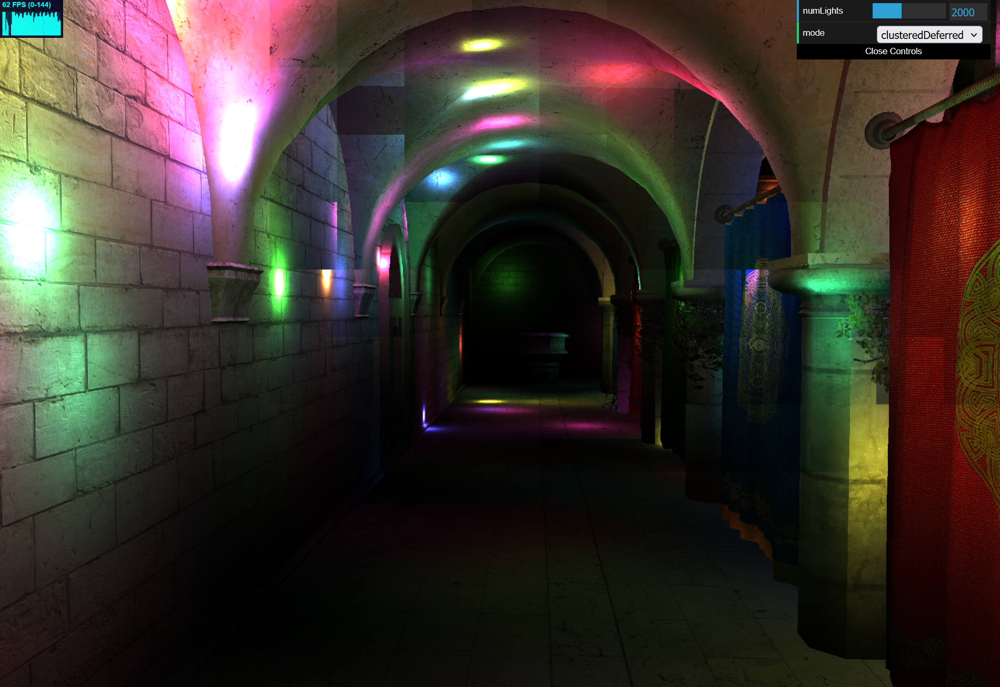 | 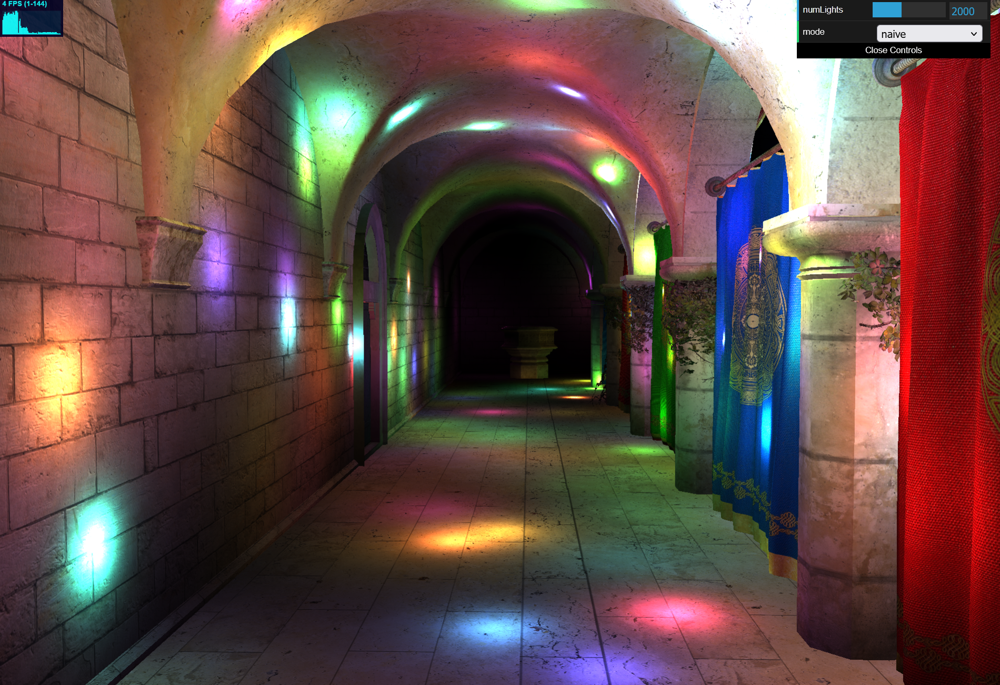 |
> | ----------------------------------------------------------- | --------------------------------------------------- |

Ideally, we would implement indirection, with a "light indices" array, and start/end pointers included in cluster info. To do this efficiently on the GPU, we would likely want a quick stream compaction method and more.

### 🏃‍➡️ Forward+ shading

Using the precomputed light x view frustum cluster, we can copy a typical naive shader, but run some quick logic on the fragment position to figure out what cell it's in:

> See below: Rotated colors applied to fragments based on their cluster index
>
> 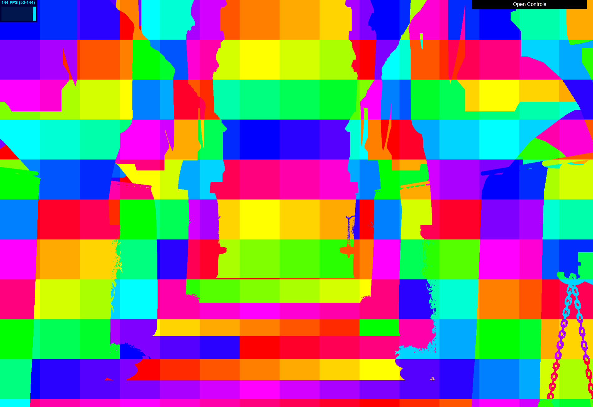

With this information and the precomputed light x cluster relations, we can run light shading **only** on fragments in clusters which we know intersect said light. There are 4000 lights in the scene, but only a small amount will affect the areas seen on-screen.

> Example: with effectively the same resulting image, the image on the right (rendered with Forward+) is achieving about 25x shorter frametimes.
>
> | 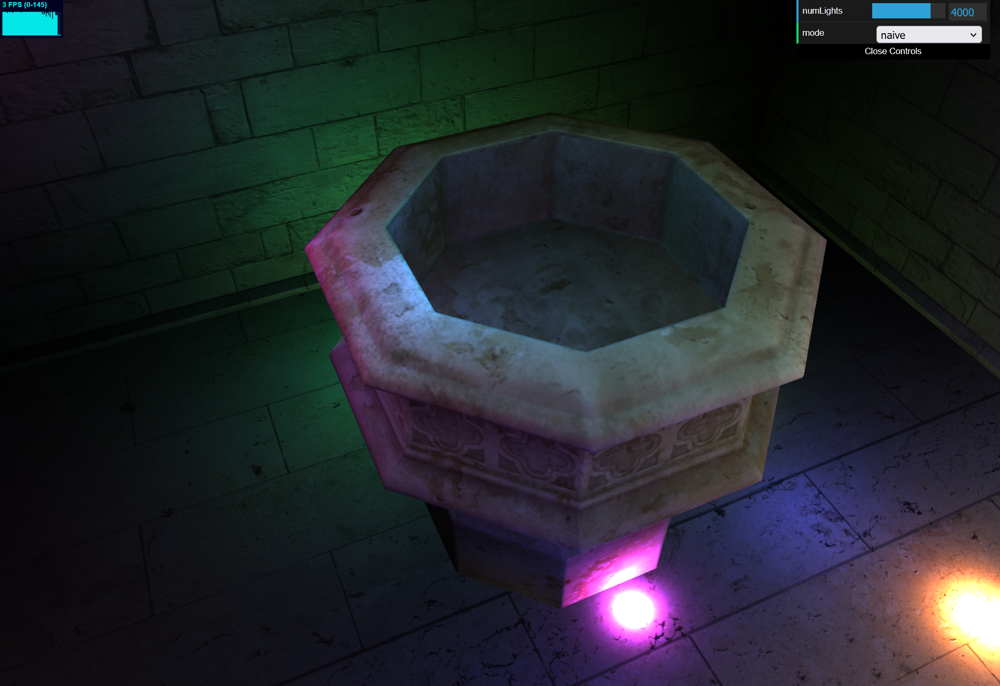 | 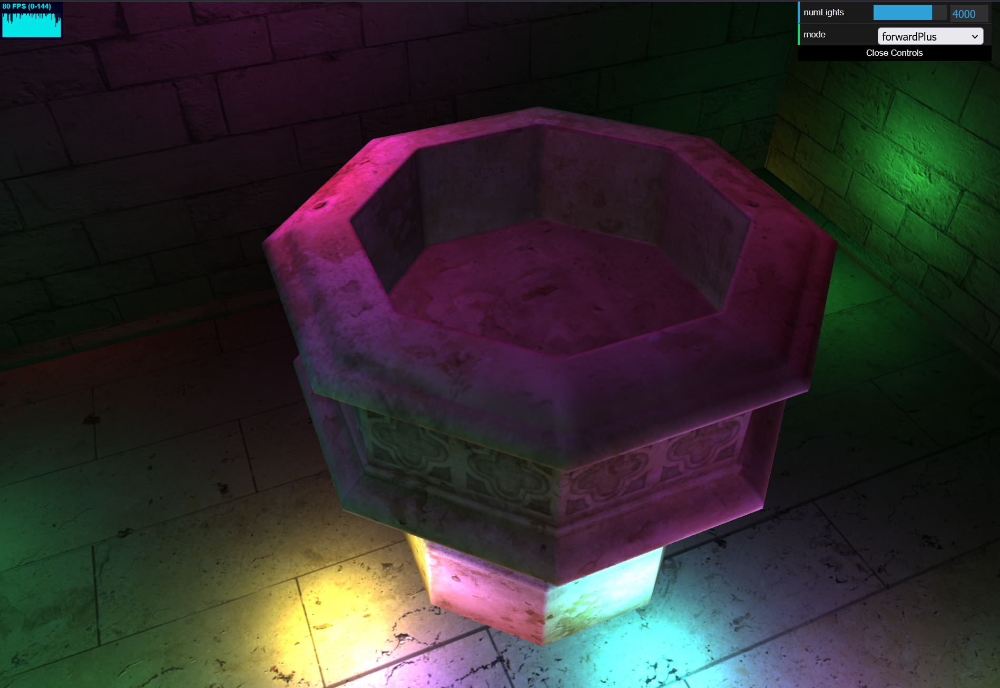 |
> | ------------------------------------------ | ------------------------------------------------- |

### 🖼️ Clustered deferred shading

To improve performance even more, we can use deferred shading techniques along with our clustering logic. We store data about each fragment, simply read from texture buffers or models, into g-buffers. These are then passed into a final shading pass which operates on a simple plane.

> See below: individual g-buffers. From left-to-right: diffuse color, world normal, world position.
>
> | 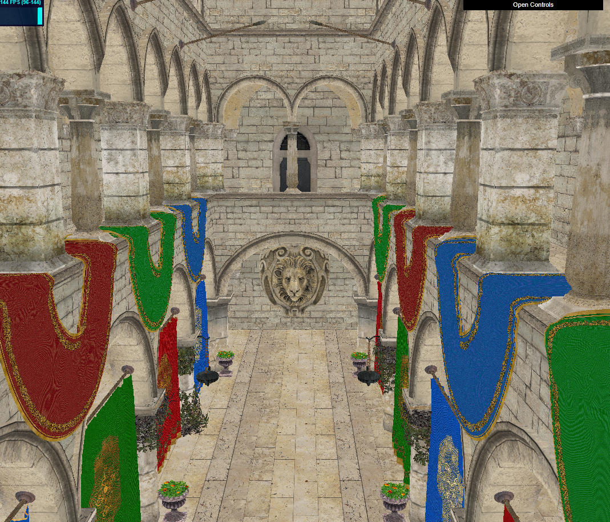 | 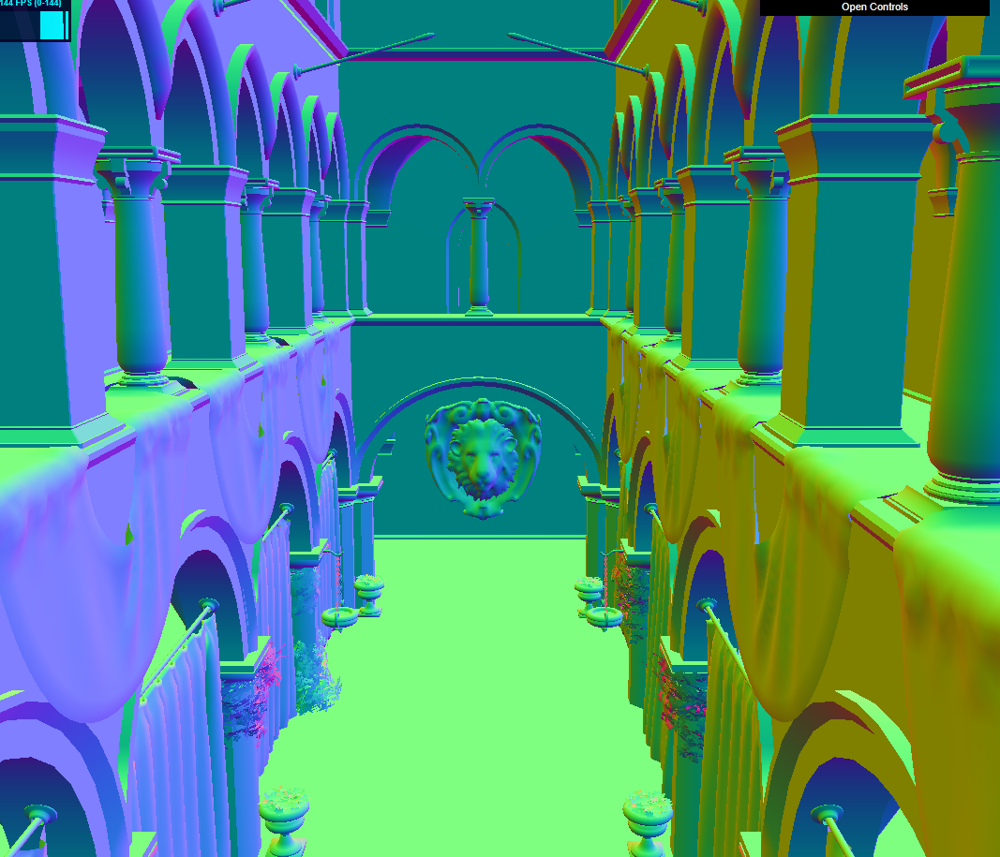 | 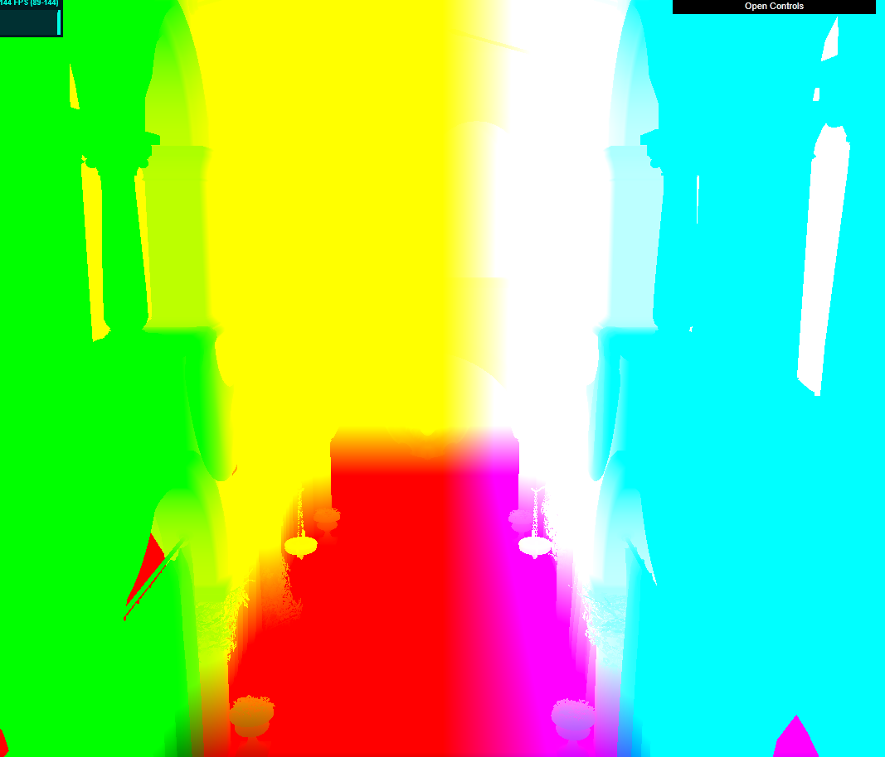 |
> | --------------------------------- | ----------------------------- | ----------------------------- |

This allows us to skip shading for any occluded fragments, only operating on those contributing to our final image. This technique increases performance greatly.

> Example: the resulting image is the same quality, but we are able to achieve 69% lower frametimes by skipping shading of occluded geometry.
>
> | 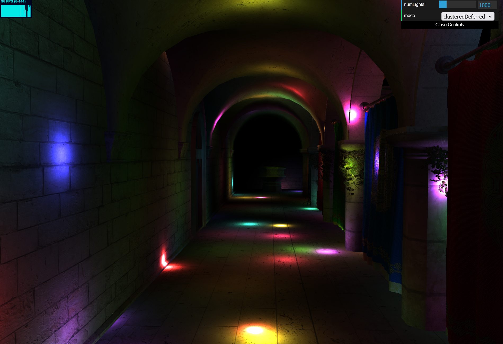 | 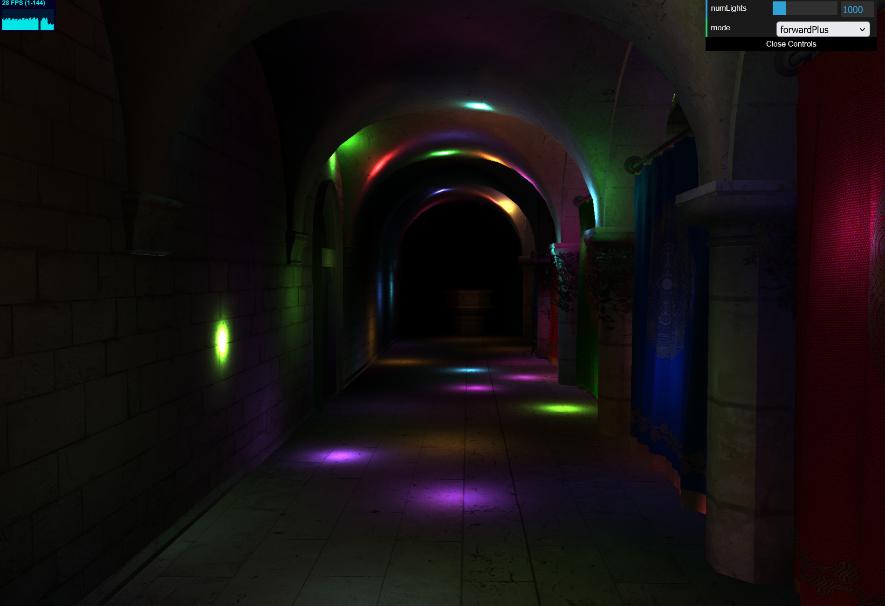 |
> | -------------------------------------------- | --------------------------------------------- |

## Analysis

Clustered shading is designed to improve performance in scenes with high dynamic light counts. We can observe this difference in performance for both the Forward+ pipeline and the Clustered Deferred pipeline.

For the data below, the "naive" render pipeline simply iterates through all lights in the scene for each fragment.

> Performance between render pipelines when increasing light count - default scene

| Number of lights | Frametime (Naive) | Frametime (Forward+) | Frametime (Deferred Clustered) |
| ---------------- | ----------------- | -------------------- | ------------------------------ |
| 250              | 33 ms             | 12-16 ms             | < 7 ms (-79%)                  |
| 500              | 66 ms             | 22-29 ms             | 9-10 ms (-85%)                 |
| 1000             | 143 ms            | 45-48 ms             | 13-15 ms (**-90%**)            |
| 2000             | 250 ms            | 63-77 ms             | 18-20 ms (**-92%**)            |
| 4000             | ~500 ms           | 71-91 ms             | 20-22 ms (**-95%**)            |

> As charts with min/max
>
> | 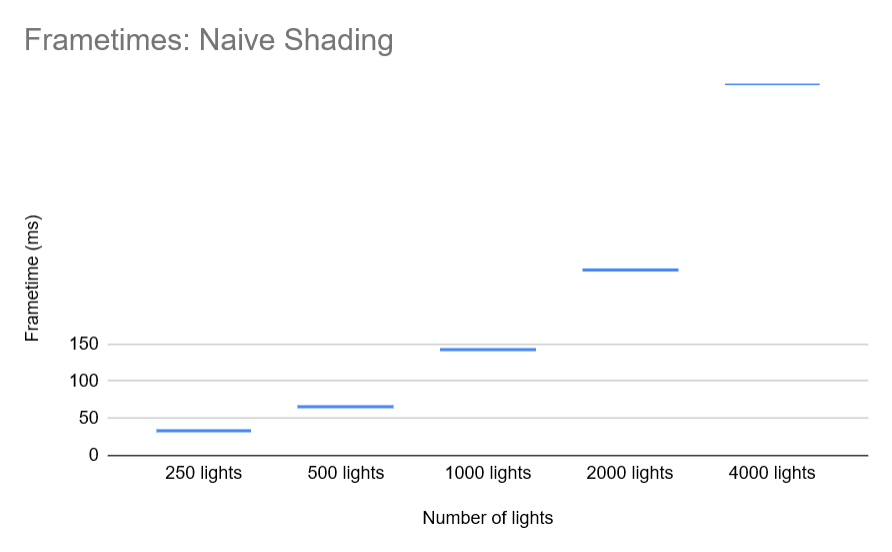 | 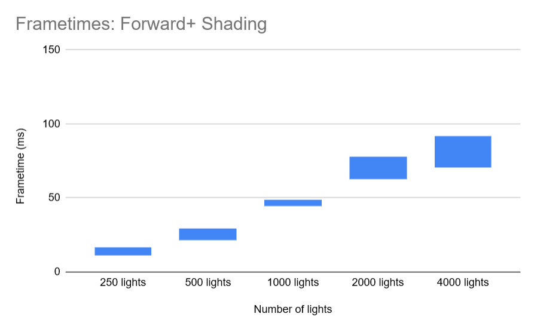 | 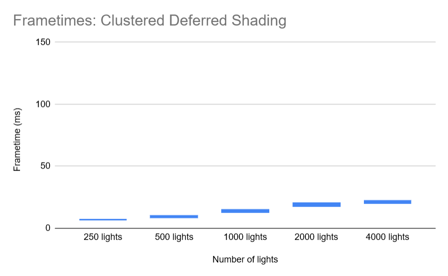 |
> | ---------------------------------- | ---------------------------------------- | ----------------------------------------- |

There are a few things to note here:

- ⚡ Performance gains are up across the board when using clustered shading! This checks out.

- 🫨 However, there is much more fluctuation in frametime when clustering. We are essentially making our GPU only do the work it "has" to do, skipping iterations if it can.
  - This is to say, if all lights in the scene overlapped all clusters, we would get effectively the same performance, and likely worse. Since our lights are constantly moving, performance conditions fluctuate.

- 🧱 When using deferred shading, performance is significantly higher. This is likely due to skipping shading computation on occluded fragments, which end up contributing nothing to the final image.

- 🐢 Our performance loss for deferred clustered shading **slows down** at higher light counts. This is because there is a hard cap on the number of lights a given cluster can be influenced by (as per GPU memory performance constraints), which results in artifacting.
  - We can increase this maximum influential light count, but depending on the GPU, the performance cost may be heavy. As mentioned above, a potential future solve for this would be to use indirection with an indices array to allow more variance in the number of influential lights per cluster.

### Credits

- [Vite](https://vitejs.dev/)
- [loaders.gl](https://loaders.gl/)
- [dat.GUI](https://github.com/dataarts/dat.gui)
- [stats.js](https://github.com/mrdoob/stats.js)
- [wgpu-matrix](https://github.com/greggman/wgpu-matrix)
